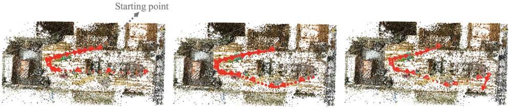

# Conversation Example
**User:** From the top of the stairs, pan downwards to the entrance of the green tunnel. Move forward to go through the tunnel. Make a u-turn and move forward to the yellow bulldozer on the table.

**ChatCam:** { "observation": "The user describes a camera trajectory starting from the top of the stairs, panning downwards to the entrance of a green tunnel, moving forward through the tunnel, making a U-turn, and moving forward to a yellow bulldozer on a table.", "reasoning": "I need to find anchor points for the top of the stairs, the entrance of the green tunnel, and the yellow bulldozer. Then, I'll generate trajectories for panning downwards, moving forward through the tunnel, making a U-turn, and moving forward to the bulldozer.", "plan": "1. Call Anchor Determinator with 'top of the stairs'. 2. Call Anchor Determinator with 'entrance of the green tunnel'. 3. Call Anchor Determinator with 'yellow bulldozer on the table'. 4. Call CineGPT with 'pan downwards'. 5. Call CineGPT with 'move forward through the tunnel'. 6. Call CineGPT with 'U-turn'. 7. Call CineGPT with 'move forward to the bulldozer'. 8. Connect the output trajectories, ensuring they pass through the anchor points. 9. Ask the user for further clarification if needed. 10. Render a video using the generated camera trajectory." }

**User:** This trajectory hits a wall! Starts all over again. But after you make a u-turn, try going to a colorful bulldozer, then to a white table with books on it, and finally to a yellow bulldozer.

**ChatCam:** {"observation": "The user indicates that the initial trajectory hits a wall and needs revision. The revised trajectory starts from the top of the stairs, pans downwards to the entrance of the green tunnel, moves forward through the tunnel, makes a U-turn, then moves to a colorful bulldozer, proceeds to a white table with books, and finally ends at a yellow bulldozer.","reasoning": "I need to find anchor points for the colorful bulldozer and the white table with books, in addition to the previously identified points. I'll regenerate the trajectory to include these new elements and ensure the path avoids any obstacles like walls.","plan": "1. Call Anchor Determinator with 'top of the stairs'. 2. Call Anchor Determinator with 'entrance of the green tunnel'. 3. Call Anchor Determinator with 'colorful bulldozer'. 4. Call Anchor Determinator with 'white table with books'. 5. Call Anchor Determinator with 'yellow bulldozer on the table'. 6. Call CineGPT with 'pan downwards to the entrance of the tunnel'. 7. Call CineGPT with 'move forward through the tunnel'. 8. Call CineGPT with 'U-turn'. 9. Call CineGPT with 'move to the colorful bulldozer'. 10. Call CineGPT with 'move to the white table with books'. 11. Call CineGPT with 'move to the yellow bulldozer'. 12. Connect the output trajectories, ensuring they pass through the anchor points and do not hit any walls. 13. Ask the user for further clarification if needed. 14. Render a video using the generated camera trajectory."}

**User:** Very good! After this, I hope to add a dolly zoom for the yellow bulldozer. Give me the final plan.

**ChatCam:** { "observation": "The user wishes to add a dolly zoom effect targeting the yellow bulldozer at the end of the revised camera trajectory.", "reasoning": "To incorporate the dolly zoom effect, I'll need to adjust the camera movement and focal length as it approaches the yellow bulldozer, ensuring that the size of the bulldozer remains consistent in the frame while creating a dramatic spatial effect.", "plan": "1. Call Anchor Determinator with 'top of the stairs'. 2. Call Anchor Determinator with 'entrance of the green tunnel'. 3. Call Anchor Determinator with 'colorful bulldozer'. 4. Call Anchor Determinator with 'white table with books'. 5. Call Anchor Determinator with 'yellow bulldozer on the table'. 6. Call CineGPT with 'pan downwards to the entrance of the tunnel'. 7. Call CineGPT with 'move forward through the tunnel'. 8. Call CineGPT with 'U-turn'. 9. Call CineGPT with 'move to the colorful bulldozer'. 10. Call CineGPT with 'move to the white table with books'. 11. Call CineGPT with 'move to the yellow bulldozer'. 12. Call CineGPT with 'dolly zoom on the yellow bulldozer'. 13. Connect the output trajectories, ensuring they pass through the anchor points, do not hit any walls, and incorporate the dolly zoom effect. 14. Ask the user for further clarification if needed. 15. Render a video using the generated camera trajectory." }

## Visualizations
The leftmost trajectory is the initial one, passing through the wall. The middle trajectory shows the correction after the user prompts ChatCam to bypass the obstacle. The rightmost trajectory incorporates a dolly zoom, added at the user's request. This demonstrates how user can interact with ChatCam and modify the generated results.

