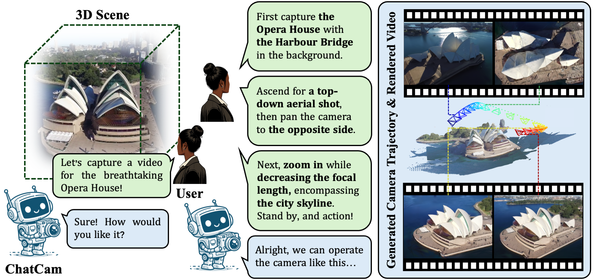

# ChatCam
This is the official implementation of paper:

> **ChatCam: Empowering Camera Control through Conversational AI**    
> Xinhang Liu, Yu-Wing Tai, Chi-Keung Tang   
> *NeurIPS 2024*    
> [Project Page](https://xinhangliu.com/chatcam) | [Paper](https://arxiv.org/abs/2409.17331)

<div>


</div>


## Installation
```bash
conda create --name nerfstudio -y python=3.8
conda activate nerfstudio
pip install torch==1.13.1 torchvision functorch --extra-index-url https://download.pytorch.org/whl/cu117
pip install ninja git+https://github.com/NVlabs/tiny-cuda-nn/#subdirectory=bindings/torch
pip install nerfstudio

git clone https://github.com/kerrj/lerf
python -m pip install -e .
ns-train -h
```

## Citation
If you find ChatCam useful in your research, please star consider citing:
```
@article{liu2024chatcam,
  title={ChatCam: Empowering Camera Control through Conversational AI},
  author={Liu, Xinhang and Tai, Yu-Wing and Tang, Chi-Keung},
  journal={arXiv preprint arXiv:2409.17331},
  year={2024}
}
```
